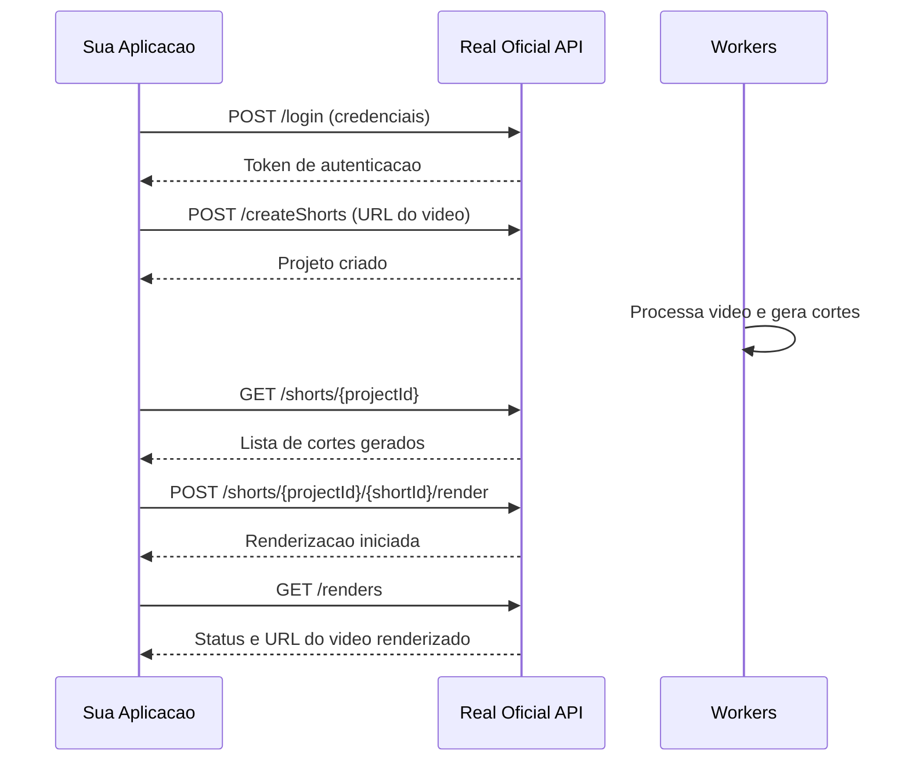

<Frame>
  
</Frame>

## Bem-vindo a API Real Oficial

A API do Real Oficial permite que voce integre nossas funcionalidades de criacao automatica de cortes de video diretamente em sua aplicacao.

<CardGroup cols={2}>
  <Card
    title="Autenticacao"
    icon="key"
    href="/authentication"
  >
    Aprenda como autenticar suas requisicoes
  </Card>
  <Card
    title="API Reference"
    icon="code"
    href="/api-reference/overview"
  >
    Explore todos os endpoints disponiveis
  </Card>
  <Card
    title="Projetos"
    icon="folder"
    href="/api-reference/projects/list"
  >
    Gerencie seus projetos de video
  </Card>
  <Card
    title="Renders"
    icon="video"
    href="/api-reference/renders/list"
  >
    Renderize e exporte seus cortes
  </Card>
</CardGroup>

## O que voce pode fazer

<AccordionGroup>
  <Accordion icon="video" title="Criar projetos a partir de videos">
    Envie uma URL do YouTube, Google Drive ou link direto (.mp4) e nosso sistema automaticamente identifica os melhores momentos para cortes.
  </Accordion>
  <Accordion icon="scissors" title="Gerar cortes automaticamente">
    Utilizamos IA para identificar os melhores trechos do seu video e gerar cortes otimizados para redes sociais.
  </Accordion>
  <Accordion icon="download" title="Renderizar e exportar">
    Exporte seus cortes em alta qualidade, prontos para publicacao no TikTok, Instagram Reels e YouTube Shorts.
  </Accordion>
</AccordionGroup>

## Fluxo basico de integracao

## Rate Limits

A API possui limites de requisicoes para garantir estabilidade:

| Endpoint | Limite |
|----------|--------|
| Login | 60 requisicoes/minuto |
| Criar Projeto | 10 requisicoes/minuto |
| Renderizar | 30 cortes/hora |

## Suporte

Precisa de ajuda? Entre em contato conosco:

<CardGroup cols={2}>
  <Card
    title="Discord"
    icon="discord"
    href="https://discord.gg/realoficial"
  >
    Junte-se a nossa comunidade
  </Card>
  <Card
    title="Email"
    icon="envelope"
    href="mailto:antonio@realoficial.com.br"
  >
    antonio@realoficial.com.br
  </Card>
</CardGroup>
