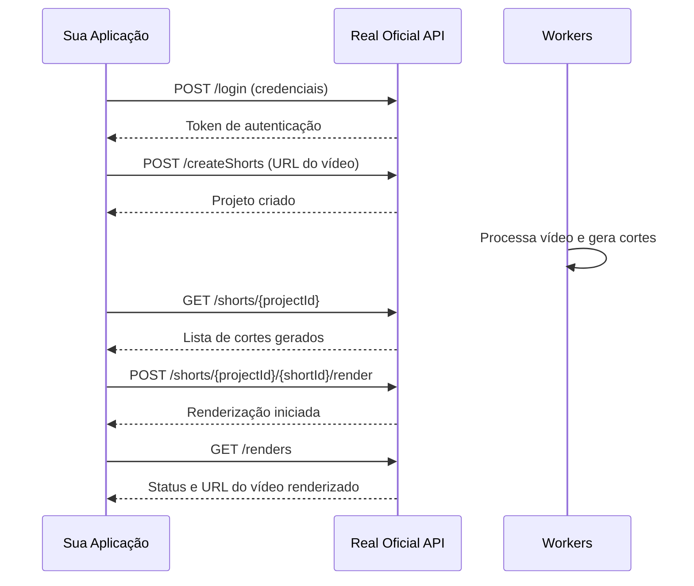

<Frame>
  
</Frame>

## Bem-vindo a API Real Oficial

A API do Real Oficial permite que você integre nossas funcionalidades de criação automática de cortes de vídeo diretamente em sua aplicação.

<CardGroup cols={2}>
  <Card
    title="Autenticação"
    icon="key"
    href="/authentication"
  >
    Aprenda como autenticar suas requisições
  </Card>
  <Card
    title="API Reference"
    icon="code"
    href="/api-reference/overview"
  >
    Explore todos os endpoints disponíveis
  </Card>
  <Card
    title="Projetos"
    icon="folder"
    href="/api-reference/projects/list"
  >
    Gerencie seus projetos de vídeo
  </Card>
  <Card
    title="Renders"
    icon="video"
    href="/api-reference/renders/list"
  >
    Renderize e exporte seus cortes
  </Card>
</CardGroup>

## O que você pode fazer

<AccordionGroup>
  <Accordion icon="video" title="Criar projetos a partir de vídeos">
    Envie uma URL do YouTube, Google Drive ou link direto (.mp4) e nosso sistema automaticamente identifica os melhores momentos para cortes.
  </Accordion>
  <Accordion icon="scissors" title="Gerar cortes automaticamente">
    Utilizamos IA para identificar os melhores trechos do seu vídeo e gerar cortes otimizados para redes sociais.
  </Accordion>
  <Accordion icon="download" title="Renderizar e exportar">
    Exporte seus cortes em alta qualidade, prontos para publicação no TikTok, Instagram Reels e YouTube Shorts.
  </Accordion>
</AccordionGroup>

## Fluxo básico de integração

```mermaid
sequenceDiagram
    participant App as Sua Aplicação
    participant API as Real Oficial API
    participant Worker as Workers

    App->>API: POST /login (credenciais)
    API-->>App: Token de autenticação

    App->>API: POST /createShorts (URL do vídeo)
    API-->>App: Projeto criado

    Worker->>Worker: Processa vídeo e gera cortes

    App->>API: GET /shorts/{projectId}
    API-->>App: Lista de cortes gerados

    App->>API: POST /shorts/{projectId}/{shortId}/render
    API-->>App: Renderização iniciada

    App->>API: GET /renders
    API-->>App: Status e URL do vídeo renderizado
```

## Rate Limits

A API possui limites de requisições para garantir estabilidade:

| Endpoint | Limite |
|----------|--------|
| Login | 60 requisições/minuto |
| Criar Projeto | 10 requisições/minuto |
| Renderizar | 50 cortes/hora (ilimitado no plano Business) |

### Limite de renderização

O limite é de **50 cortes por hora** para todos os planos, exceto o plano **Business**, que possui renderizações ilimitadas.

Pedidos de renderização não são rejeitados com base no tamanho atual da fila de processamento. As proteções contra render duplicado ou já em andamento continuam ativas.

## Suporte

Precisa de ajuda? Entre em contato conosco:

<CardGroup cols={2}>
  <Card
    title="Discord"
    icon="discord"
    href="https://discord.gg/realoficial"
  >
    Junte-se a nossa comunidade
  </Card>
  <Card
    title="Email"
    icon="envelope"
    href="mailto:antonio@realoficial.com.br"
  >
    antonio@realoficial.com.br
  </Card>
</CardGroup>
